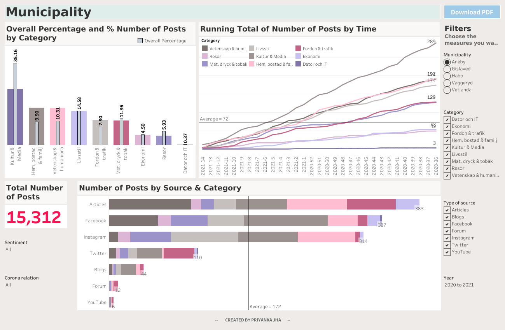
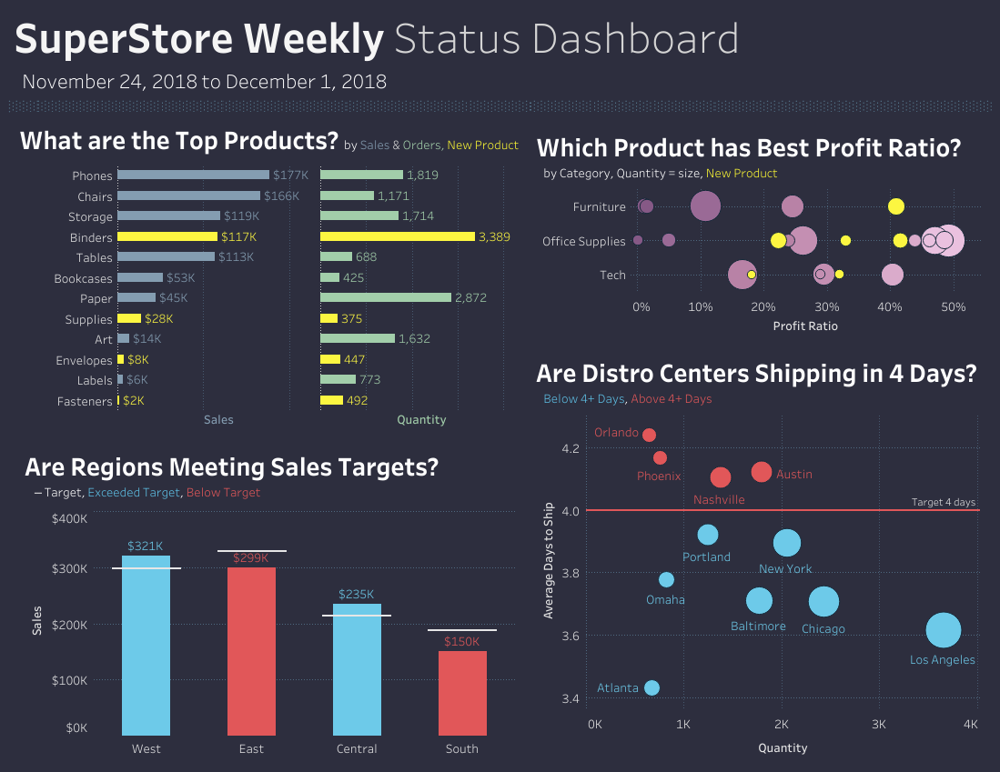
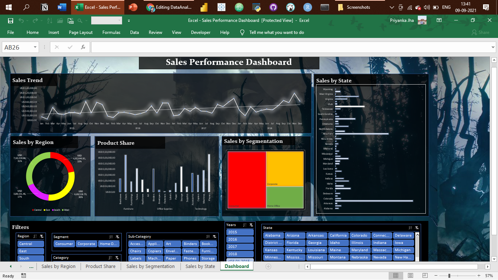
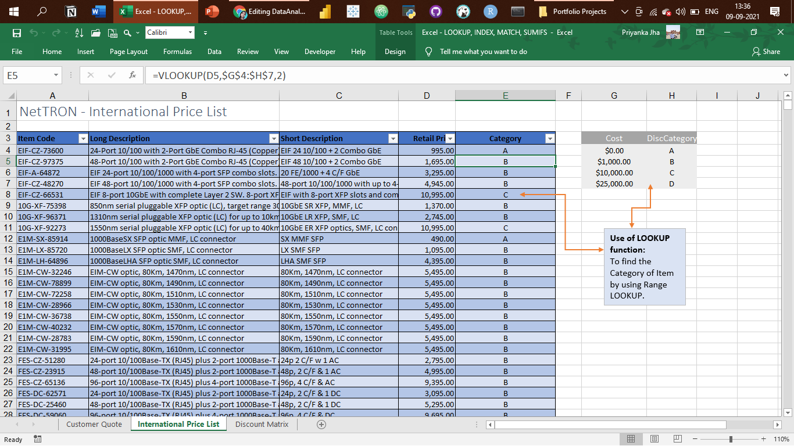

# Portfolio Projects
## Following are my projects in SQL, Python, Tableau & Excel:  

- [x] **SQL & Tableau** - 
  - Instagram Clone Data Analysis Project 

- Municipality Data Analysis Dashboard: https://public.tableau.com/views/MunicipalityDashboard/Municipality?:language=en-GB&:display_count=n&:origin=viz_share_link

  

- GROVER Junior Data Analyst Case Study Dashboard: https://public.tableau.com/views/GROVERJuniorDataAnalystCaseStudy/GroverDataAnalystDashboard?:language=en-GB&:display_count=n&:origin=viz_share_link

  

- Retail Pricing Analytics Dashboard: https://public.tableau.com/app/profile/priyankajhatheanalyst/viz/RetailPriceAnalyticsDashboard/RetailPricingAnalytics#2

- E-commerce Sales Dashboard: https://public.tableau.com/app/profile/priyankajhatheanalyst/viz/eCommerceSales_16310934566250/ExploratoryVisualAnalysis

- Sales SuperStore Deep Data Analysis (5 Dashboards): https://public.tableau.com/app/profile/priyankajhatheanalyst/viz/SuperStoreDataset5Dashboards/1KPIDashboard 
      
      1 KPI Dashboard

      2 Top-Down Dashboard
      

      3 Q&A Dashboard
      

      4 Bottom-Up Dashboard
      

      5 Geo Chart
      

- World Bank CO2 Emissions Dashboard: https://public.tableau.com/views/WorldBankCo2Emissions_16149182681650/Dashboard1?:language=en-GB&:display_count=n&:origin=viz_share_link 

- London Bus Safety Dashboard: https://public.tableau.com/views/TableauCertificationCourse2/ChartsDashboard?:language=en-GB&:display_count=n&:origin=viz_share_link 

- [x] **Excel** - 

*Kindly download these Excel files from this repository and view them in Microsoft Excel.*

- Sales Superstore Sample: Sales Performance Dashboard  

- NetTRON Network Infrastructure Data : LOOKUP, INDEX, MATCH, SUMIFS  

- Shipping Data: Pivot Tables, Pivot Chart, Slicers  

- Project Costing Model Data: Scenario Manager, Solver (Data Modeling)

--------------------------------------------------------------------------------------------------------------------------------------------------------------------------------
